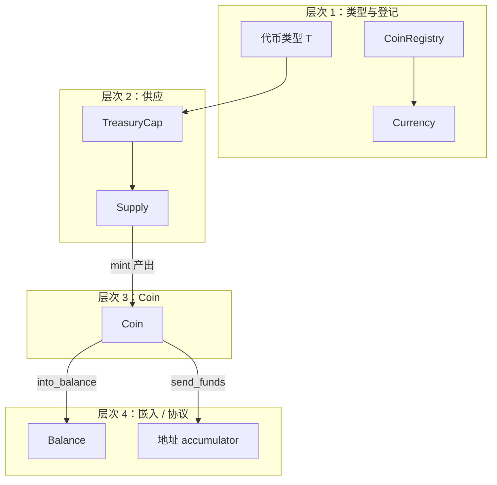

# 本章导论：Sui 上的「钱」——从类型到策略

## 本节要回答的问题

- 自定义代币在链上**究竟是什么**（不是「一个智能合约变量」，而是一套 **类型 + 供应账本 + 可转移对象** 的组合）？  
- **`Balance`、`Coin`、`TreasuryCap`、`Currency`、`Token`** 各自解决哪一类问题，边界在哪里？  
- **开放环路（Coin）** 与 **闭环（Token）** 的分工是什么，为什么官方要提供两套？

若你尚未熟悉 **`Balance` 与 `Coin` 的底层定义**，请先阅读 [第十二章 §12.11 · Balance 与 Coin](../12_programmability/11-balance-and-coin.md)，本章在此基础上讨论**发币、注册、合规与策略**。

---

## 一条主线：四种「层次」

把 Sui 上的 fungible 资产想成四层叠在一起，**上层依赖下层语义**，混淆层次是初学者最常见的错误。

| 层次 | 核心抽象 | 回答的问题 |
|------|-----------|------------|
| **1. 类型与登记** | 币种类 `T`、**`Currency<T>`**、**`CoinRegistry`** | 「这种币叫什么、多少位小数、是否受监管、供应状态是否在登记簿上可见？」 |
| **2. 总供应账本** | **`Supply<T>`**（包在 **`TreasuryCap<T>`** 里） | 「全链已发行/已销毁的总量如何单调变化？谁有权 `mint` / `burn`？」 |
| **3. 用户可持对象（开放环路）** | **`Coin<T>`**（`key + store`） | 「用户钱包里一笔笔可点的余额对象是什么？如何拆分、合并、转账？」 |
| **4. 嵌入或协议层** | **`Balance<T>`**、**地址资金 accumulator** | 「池子、金库、结算用的**非独立对象**余额在哪里？与 Explorer 里列出的 `Coin` 列表是什么关系？」 |

**精髓**：**`TreasuryCap` 管「印多少」**；**`Coin` 管「谁手里有多少枚对象」**；**`Currency` 管「这类币在全网目录里长什么样」**；**`Balance` 管「嵌在别处的数额」**。四者通过 Framework API 衔接，而不是互相替代。

---

## `Coin<T>`：开放环路（Open Loop）

**`Coin<T>`** 具备 **`store`**，因此可以：

- 作为 **`public_transfer`** 的独立对象流动；  
- 被任意已发布包在 **PTB** 中组合（只要类型匹配、规则满足）；  
- 与钱包、浏览器、DEX 的「按对象列举余额」模型一致。

这就是通常所说的 **开放环路**：价值以 **`Coin`** 为载体，**可组合性**最强。

## `Token<T>`：闭环（Closed Loop）

**`Token<T>`** **只有 `key`，没有 `store`**。它不能像普通 **`Coin`** 那样被任意模块随意塞进别的结构里当「可长期存放的代币字段」。  
对 **`Token`** 的 **转账、消费、与 `Coin` 互转** 会生成 **`ActionRequest`**，必须由 **`TokenPolicy<T>`** 声明的规则（及可选 **Rule** 模块）**确认**之后，动作才在语义上闭环。

**精髓**：**Coin = 默认可组合现金**；**Token = 带「策略闸」的余额载体**，适合积分、强许可消费、合规出口可控等场景。二者可共用 **`TreasuryCap`**，供应模型一致，**差异在转移与消费权限**。

---

## 「自有」与「共享」——不要读错

| 说法 | 含义 |
|------|------|
| **地址自有** | 某地址作为 **owner** 持有的 **`Coin<T>`** 对象；可 **`split` / `join`**。 |
| **共享对象（类型级）** | **`CoinRegistry`**（系统维护的注册中心）及登记在其中的 **`Currency<T>`**：表示**这类币的全局元数据与状态**，不是「多人分同一笔钱」。 |

**误区**：「共享 Coin」≠ 把一枚 `Coin` 变成共享对象。共享的是 **登记簿上的类型信息**；用户余额仍是各自拥有的 **`Coin`** 或合约内的 **`Balance`**。

---

## 与官方模块的对应（便于读源码）

| 主题 | 主要模块 |
|------|-----------|
| 余额与供应底层 | `sui::balance` |
| 硬币对象与 Treasury、Deny 相关 | `sui::coin` |
| 注册与 `Currency` | `sui::coin_registry` |
| 全局黑名单基础设施 | `sui::deny_list` |
| 闭环代币与策略 | `sui::token` |
| 地址资金与赎回 | `sui::funds_accumulator`（与 `balance::send_funds` 等配合） |
| 聚合根 | `sui::accumulator` |

API 细节以你目标网络所链接的 **`sui-framework`** 版本为准；升级迁移时务必对照 **Release Notes**。

---

## 本章阅读顺序

建议按节号顺序阅读：**先建立注册与元数据（§15.2–14.3）→ 供应与 Treasury（§15.4）→ 用户侧 Coin 操作（§15.5）→ 再区分注册表与地址资金（§15.6–14.7）→ 合规与 Token（§15.8–14.10）→ 最后 Accumulator 与综合模式（§15.11–14.14）**。

下一节从 **`coin_registry::new_currency_with_otw`** 与 **OTW** 开始，走通「一生成一次」的币种创建路径。
